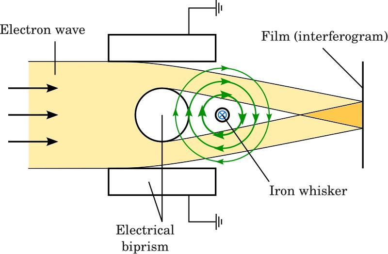
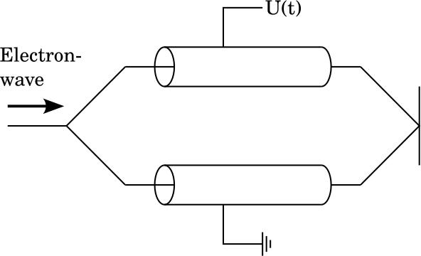
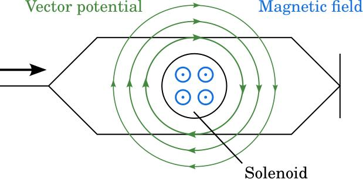
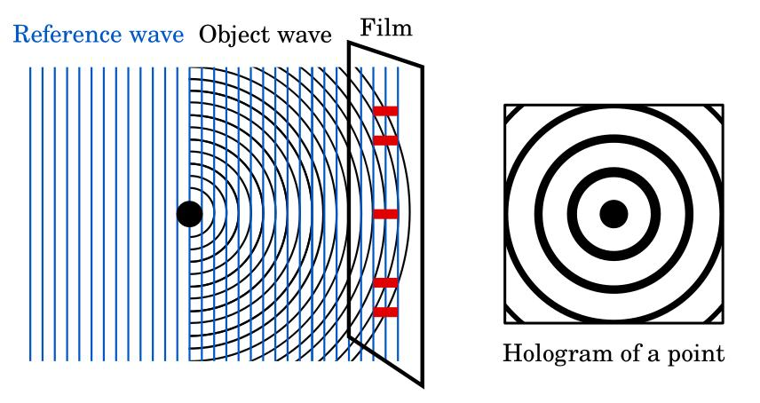
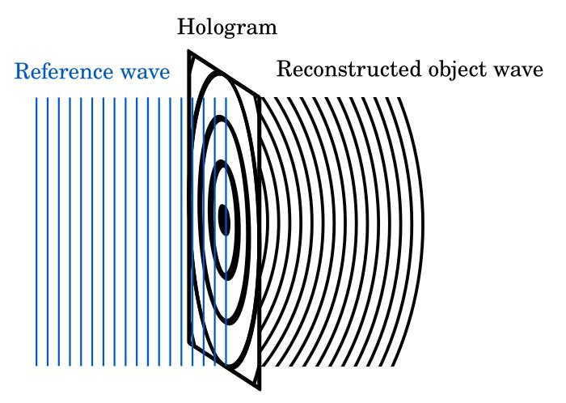
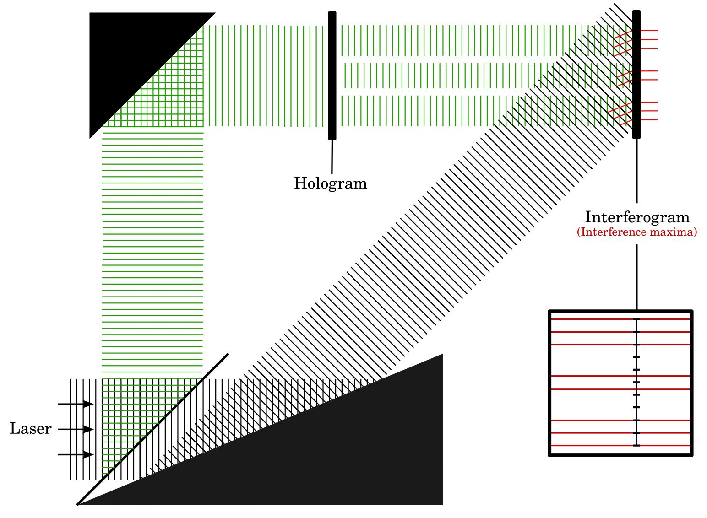
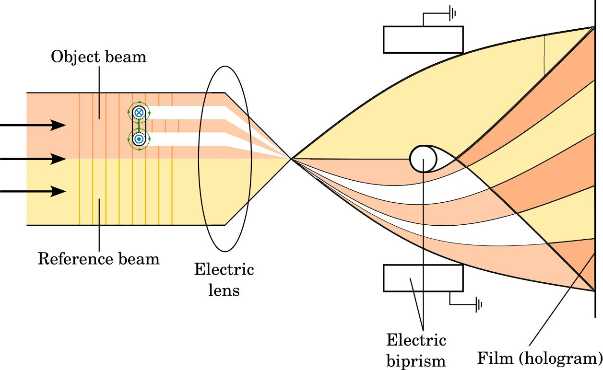
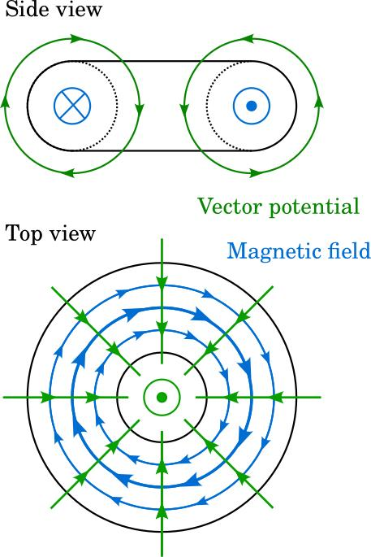

# Aharonov–Bohm Effect: Experiments and Reusable Scientific Figures

Original scientific figures and bilingual seminar handouts about key experimental
demonstrations of the **Aharonov–Bohm effect**. The material was created for my
contribution to the *Key Experiments in Quantum Science* seminar at Heidelberg
University.

The handouts focus on Chambers' 1960 electron-interference experiment and
Tonomura's 1986 experiment with a completely shielded magnetic field. The figure
collection also covers the electric and magnetic Aharonov–Bohm effects, electron
holography, electron interferometry, point-source holography, and toroidal magnets.
It is intended for physics teaching, presentations, lecture notes, and other
educational material.

## Handouts

- [English handout (PDF)](handout-english.pdf)
- [German handout / Deutsches Handout (PDF)](handout-german.pdf)

## Figure Gallery

The white-background previews below are rendered from the English PDFs. Click a
preview to open the corresponding PDF. Every illustration is also available as an
editable **SVG** and a high-resolution **PNG**. Corresponding
[German versions](figures-german/) are included.

| Preview | Description and downloads |
| --- | --- |
| [](figures-english/pdf/chambers_setup.pdf) | **Chambers experiment (1960).** Experimental arrangement showing the electron wave passing an iron whisker, the electrical biprism, and the resulting interferogram. <br><br> [SVG](figures-english/svg/chambers_setup.svg) · [PDF](figures-english/pdf/chambers_setup.pdf) · [PNG](figures-english/png/chambers_setup.png) |
| [](figures-english/pdf/electric_AB_setup.pdf) | **Electric Aharonov–Bohm effect.** Schematic electron interferometer with two paths exposed to different time-dependent electric potentials. <br><br> [SVG](figures-english/svg/electric_AB_setup.svg) · [PDF](figures-english/pdf/electric_AB_setup.pdf) · [PNG](figures-english/png/electric_AB_setup.png) |
| [](figures-english/pdf/magnetic_AB_setup.pdf) | **Magnetic Aharonov–Bohm effect.** Two electron paths enclose a solenoid, illustrating the magnetic field and vector potential relevant to the phase shift. <br><br> [SVG](figures-english/svg/magnetic_AB_setup.svg) · [PDF](figures-english/pdf/magnetic_AB_setup.pdf) · [PNG](figures-english/png/magnetic_AB_setup.png) |
| [](figures-english/pdf/point_holography_step_1.pdf) | **Point-source holography: recording.** Interference of a plane reference wave with a spherical object wave produces a point hologram. <br><br> [SVG](figures-english/svg/point_holography_step_1.svg) · [PDF](figures-english/pdf/point_holography_step_1.pdf) · [PNG](figures-english/png/point_holography_step_1.png) |
| [](figures-english/pdf/point_holography_step_2.pdf) | **Point-source holography: reconstruction.** Illumination of the hologram by a reference wave reconstructs the original object wave. <br><br> [SVG](figures-english/svg/point_holography_step_2.svg) · [PDF](figures-english/pdf/point_holography_step_2.pdf) · [PNG](figures-english/png/point_holography_step_2.png) |
| [](figures-english/pdf/tonomura_hologram_to_interferogram.pdf) | **Hologram-to-interferogram reconstruction.** Optical arrangement used to reconstruct an electron hologram and obtain an interference pattern. <br><br> [SVG](figures-english/svg/tonomura_hologram_to_interferogram.svg) · [PDF](figures-english/pdf/tonomura_hologram_to_interferogram.pdf) · [PNG](figures-english/png/tonomura_hologram_to_interferogram.png) |
| [](figures-english/pdf/tonomura_holography_setup.pdf) | **Tonomura electron-holography setup.** Object and reference electron beams are combined with an electron biprism to record a hologram. <br><br> [SVG](figures-english/svg/tonomura_holography_setup.svg) · [PDF](figures-english/pdf/tonomura_holography_setup.pdf) · [PNG](figures-english/png/tonomura_holography_setup.png) |
| [](figures-english/pdf/toroidal_magnet.pdf) | **Toroidal magnet.** Side and top views showing the confined magnetic field and the vector potential outside the magnet. <br><br> [SVG](figures-english/svg/toroidal_magnet.svg) · [PDF](figures-english/pdf/toroidal_magnet.pdf) · [PNG](figures-english/png/toroidal_magnet.png) |

## Choosing a File Format

- **SVG** — best for editing, translation, and scalable use on the web.
- **PDF** — best for LaTeX documents, printing, and other publication workflows.
- **PNG** — best for quick previews, slides, and software without vector support.

## License, Citation, and Reuse

The original figures in [`figures-english/`](figures-english/) and
[`figures-german/`](figures-german/) were created by **Matti Weber** and are
licensed under the [Creative Commons Attribution 4.0 International License](LICENSE)
(CC BY 4.0). You may share and adapt them for any purpose, provided that you give
appropriate credit, link to the license, and indicate whether you made changes.

The handout PDFs are not covered by this license as a whole. Third-party material
cited or reproduced within them remains subject to the rights and terms of its
respective source.

Suggested attribution:

> Figure by Matti Weber, from *Aharonov–Bohm Effect: Experiments and Reusable
> Scientific Figures*, 2026, <https://github.com/24rev/Seminar-AB-Effect>.

Suggested repository citation:

> Weber, Matti (2026). *Aharonov–Bohm Effect: Experiments and Reusable Scientific
> Figures*. GitHub repository. <https://github.com/24rev/Seminar-AB-Effect>.

## Repository Structure

```text
.
├── handout-english.pdf
├── handout-german.pdf
├── figures-english/
│   ├── svg/
│   ├── pdf/
│   └── png/
└── figures-german/
    ├── svg/
    ├── pdf/
    └── png/
```
